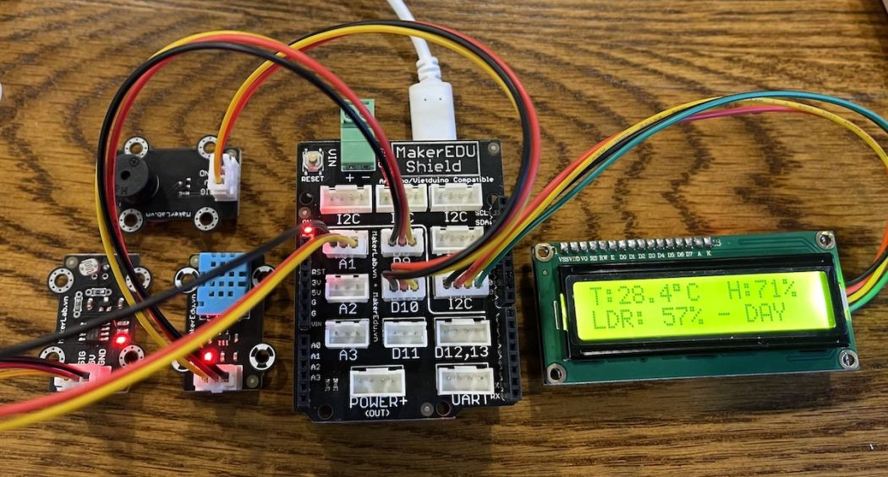
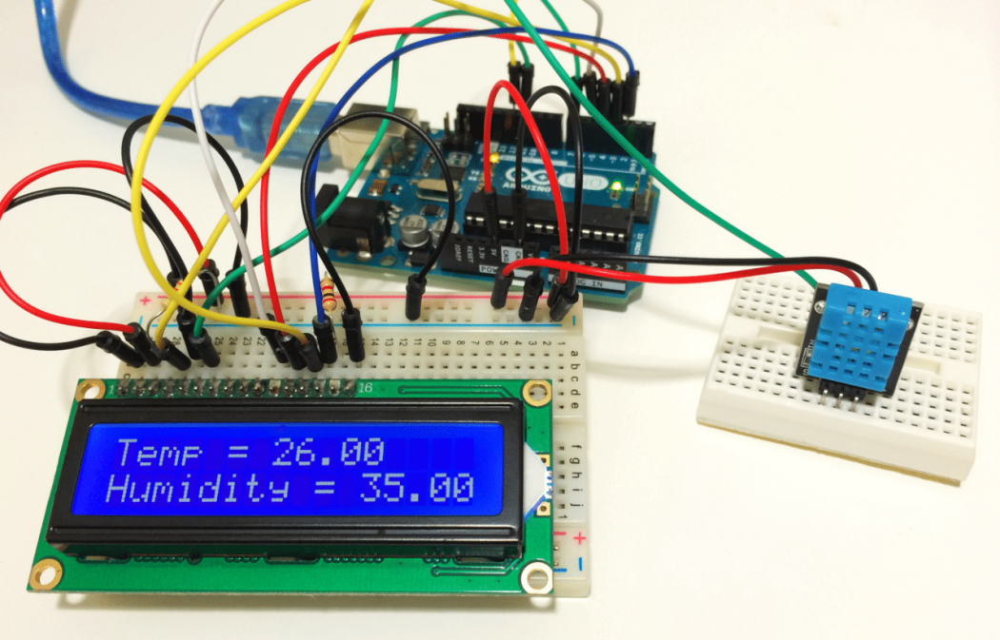
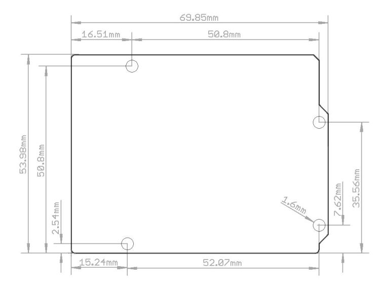

# Mạch MakerEdu Shield for Vietduino

## Giới thiệu

**MakerEdu Shield for Vietduino** được nghiên cứu và và sản xuất bởi MakerLab.vn là một bo mạch trung gian chuẩn Arduino Shield, giúp bạn kết nối các mạch điều khiển trung tâm **Arduino/Vietduino** với các **Module Chức Năng** và **Cảm Biến** trong _**Hệ sinh thái phần cứng Robotics MakerEdu**_ qua cổng kết nối chuẩn XH2.54 giúp kết nối dễ dàng và chống ngược, sai các chân kết nối.

Mạch MakerEdu Shield for Vietduino tương thích với các mạch điều khiển trung tâm sau:

- Mạch Arduino Uno và các mạch có thiết kế tương tự
- Mạch Arduino Mega 2560 và các mạch có thiết kế tương tự
- Mạch Vietduino Uno (Arduino Uno Compatible)
- Mạch Vietduino Mega 2560 (Arduino Mega2560 Compatible)
- Mạch Vietduino Wifi BLE ESP32 (Arduino Compatible)

> **Lưu ý:**
Mạch MakerEdu Shield for Vietduino sẽ tương thích tốt nhất khi sử dụng với các mạch Vietduino giúp phát huy tối đa các chức năng của mạch.

> Dự án "Mô phỏng hệ thống giám sát môi trường trong nông nghiệp thông minh" với module hiển thị LCD, cảm biến nhiệt độ độ ẩm, cảm biến ánh sáng, module còi báo động kết nối với Vietduino Uno qua MakerEdu Shield.

> Một dự án tương tự với cảm biến nhiệt độ độ ẩm và màn hình LCD nối bằng dây cắm đơn qua Breadboard.
## Thông số kỹ thuật
<table><thead>
  <tr>
    <th>Model</th>
    <th>MakerEdu Shield for Vietduino</th>
  </tr></thead>
<tbody>
  <tr>
    <td>Chuẩn kết nối với mạch điều khiển trung tâm</td>
    <td>Arduino Shield</td>
  </tr>
  <tr>
    <td>Chuẩn Conector</td>
    <td>XH2.54 3Pins / 4Pins</td>
  </tr>
  <tr>
    <td>Nguồn đầu vào</td>
    <td>VIN từ Domino hoặc VIN từ mạch điều khiển trung tâm</td>
  </tr>
  <tr>
    <td>Cổng Digital I/O đơn</td>
    <td>7 cổng: A1, A2, A3, D9, D10, D11 (Digital Signal-5V-GND)</td>
  </tr>
  <tr>
    <td>Cổng Digital I/O đôi</td>
    <td>1 cổng: D12+D13 (D12-D13-5V-GND)</td>
  </tr>
  <tr>
    <td>Cổng Analog Input</td>
    <td>3 cổng: A1, A2, A3 (Analog Signal-5V-GND)</td>
  </tr>
  <tr>
    <td>Cổng giao tiếp I2C</td>
    <td>5 cổng (SCL-SDA-5V-GND)</td>
  </tr>
  <tr>
    <td>Cổng giao tiếp UART</td>
    <td>1 cổng (TX-RX-5V-GND)</td>
  </tr>
  <tr>
    <td>Cổng cấp nguồn đầu ra bổ sung POWER+</td>
    <td>1 cổng Output (3V3-5V-VIN-GND)</td>
  </tr>
  <tr>
    <td>Tích hợp</td>
    <td>Led nguồn, nút nhấn Reset</td>
  </tr>
</tbody></table>

## Hình ảnh sản phẩm

## Kích thước sản phẩm

## Các chân tín hiệu

## Hướng dẫn sử dụng

### Các thiết bị sử dụng trong bài hướng dẫn

#### Arduino

- [Mạch Vietduino Uno (Arduino Uno Compatible)](https://www.makerlab.vn/vuno)
- [Mạch MakerEdu Shield for Vietduino]()
- [Mạch led đơn MKE-M01 10mm single LED module***]()

### Hướng dẫn sử dụng với Arduino (Code C)
  
[Hướng dẫn cài đặt phần mềm, nạp chương trình, cài đặt bộ thư viện Arduino cơ bản.](https://github.com/makerlabvn/Arduino-Vietduino)

- Tải và cài đặt [phần mềm Arduino tại đây.](https://www.arduino.cc/en/software)
- Trong **Tools / Library Manager**, tìm và cài đặt bộ thư viện tổng hợp **"MAKERLABVN" by MakerLab.vn**
- Mở chương trình mẫu

## Hỗ trợ và liên hệ

- Website: [https://www.makerlab.vn/](https://www.makerlab.vn/)
- Facebook: [https://www.facebook.com/makerlabvn](https://www.facebook.com/makerlabvn)

## Nhà phân phối

- Các bạn có thể mua sản phẩm của MakerLab tại các [Nhà Phân Phối.](https://www.makerlab.vn/distributor/)
